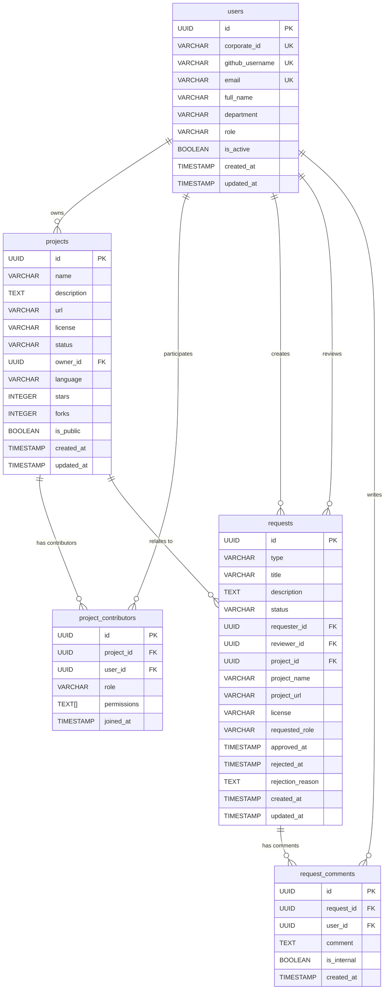
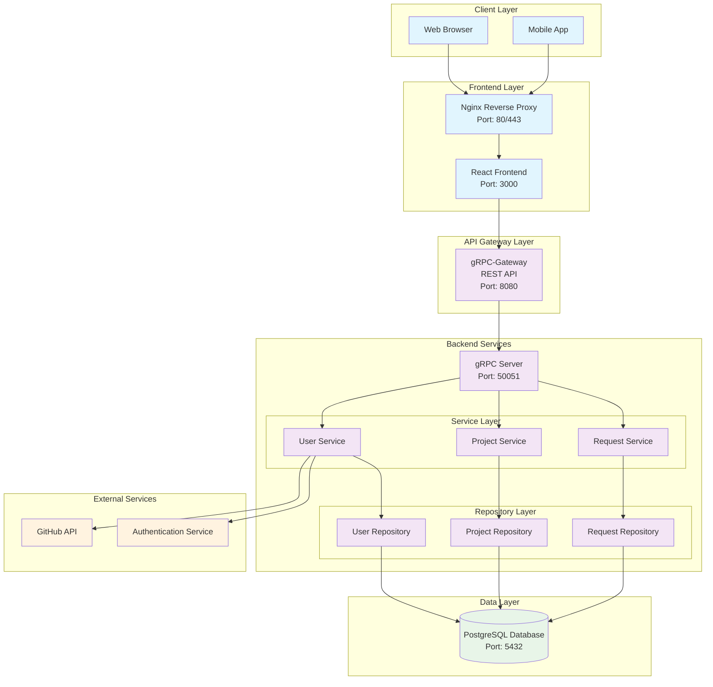
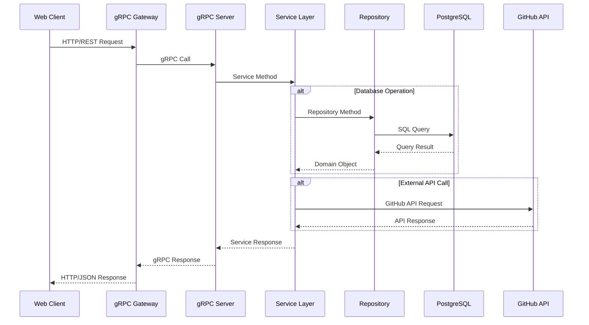

# SourceStream Architecture Documentation

This document provides comprehensive architectural diagrams for the SourceStream platform, including database schema and system architecture.

## Database Schema

The SourceStream platform uses PostgreSQL as its primary database with the following entity relationships:

## System Architecture

The SourceStream platform follows a microservices architecture with clear separation between frontend, backend, and database layers:

## Component Flow Diagram

This diagram shows the typical request flow through the system:

## Technology Stack

### Frontend

- **Framework**: React 18 with TypeScript
- **Build Tool**: Vite
- **UI Library**: Chakra UI v3
- **Icons**: React Icons (Feather Icons)
- **Styling**: Chakra UI Design System
- **State Management**: React Context/Hooks

### Backend

- **Language**: Go 1.19+
- **gRPC Framework**: google.golang.org/grpc
- **REST Gateway**: grpc-gateway
- **Database ORM**: Standard database/sql
- **Protocol Buffers**: protoc compiler

### Database

- **Primary Database**: PostgreSQL 12+
- **Migration Tool**: Custom SQL migrations
- **Connection Pooling**: Built-in Go database/sql

### Infrastructure

- **Containerization**: Docker
- **Orchestration**: Kubernetes
- **Reverse Proxy**: Nginx
- **Monitoring**: Prometheus + Grafana

## Key Design Patterns

1. **Repository Pattern**: Separates data access logic from business logic
2. **Service Layer Pattern**: Encapsulates business logic and coordinates between repositories
3. **gRPC + REST Gateway**: Provides both high-performance gRPC and web-friendly REST APIs
4. **Domain-Driven Design**: Clear separation of concerns with domain models
5. **Microservices Architecture**: Loosely coupled, independently deployable services

## Security Considerations

- **Authentication**: Corporate ID-based authentication with GitHub integration
- **Authorization**: Role-based access control (RBAC) with project-level permissions
- **Data Validation**: Input validation at both API gateway and service layers
- **Database Security**: Parameterized queries to prevent SQL injection
- **Transport Security**: TLS encryption for all external communications

## Scalability Features

- **Horizontal Scaling**: Stateless services can be scaled independently
- **Database Indexing**: Optimized indexes for common query patterns
- **Connection Pooling**: Efficient database connection management
- **Caching Strategy**: Ready for Redis integration for session and data caching
- **Load Balancing**: Nginx reverse proxy with upstream load balancing
